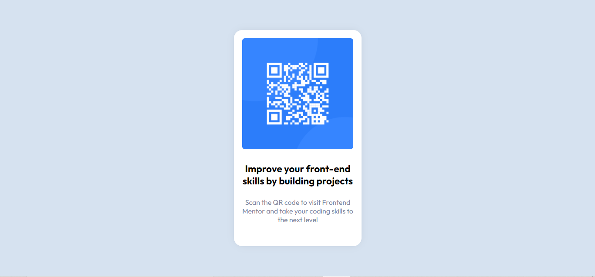

# Frontend Mentor - QR code component solution

This is a solution to the [QR code component challenge on Frontend Mentor](https://www.frontendmentor.io/challenges/qr-code-component-iux_sIO_H). Frontend Mentor challenges help you improve your coding skills by building realistic projects. 

## Table of contents

- [Overview](#overview)
  - [Screenshot](#screenshot)
  - [Links](#links)
- [My process](#my-process)
  - [Built with](#built-with)
  - [What I learned](#what-i-learned)
  - [Continued development](#continued-development)
  - [Useful resources](#useful-resources)
- [Author](#author)
- [Acknowledgments](#acknowledgments)

## Overview

### Screenshot

### Links

- Solution URL: [Repository]()
- 
- Live Site URL: [Live website URL](https://dhanashri-shirsath.github.io/Frontend-Mentor-Solutions/QR-code-component-challenge/)

## My process

### Built with

- Semantic HTML5 markup
- CSS custom properties
- Flexbox
- Mobile-first workflow

### What I learned
This is the first challenge which I have completing successfully.It helped me to brush my basic HTML,CSS skills.It's simple and easy.

### Useful resources

- [MDN](https://developer.mozilla.org/) -This helped me to align div in center.

## Author
- Name - Dhanashri Shirsath
- Frontend Mentor - [@Dhanashri-Shirsath](https://www.frontendmentor.io/profile/Dhanashri-Shirsath)

